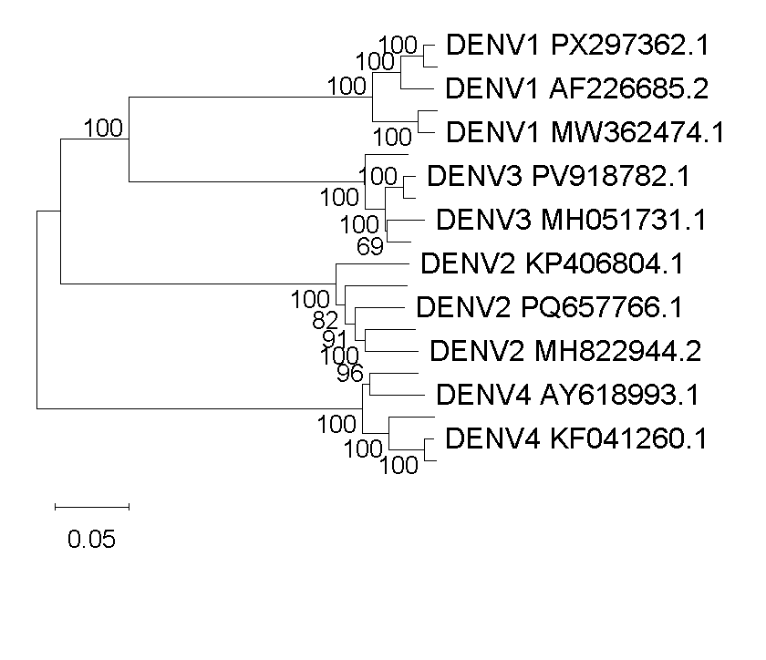
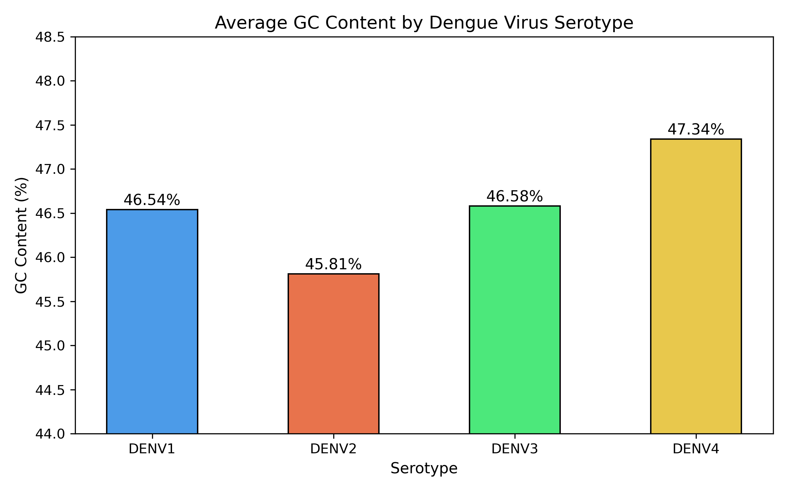

# Dengue Virus Genomic Analysis
### Comparative analysis of DENV-1, DENV-2, DENV-3, and DENV-4 complete genomes

**Author:** Gaayathri P S  
**Date:** June 2026  
**Institution:** B.Tech Biotechnology — Year 1  

---

## Project Overview
This independent bioinformatics project performs a comparative 
genomic analysis of all four dengue virus serotypes using 20 
complete genome sequences retrieved from NCBI GenBank. The 
analysis addresses a key public health question — why does 
immunity to one dengue serotype fail to protect against the 
others?

Dengue is endemic in Tamil Nadu, India, making this question 
locally and clinically relevant.

---

## Research Question
How genomically distinct are the four dengue virus serotypes, 
and what does this tell us about cross-serotype immunity failure?

---

## Key Findings

- DENV-4 has the highest GC content (47.34%) and DENV-2 the 
  lowest (45.81%) — a consistent difference across all sequences
- Phylogenetic analysis confirms 4 distinct genomic clusters 
  with 100% bootstrap support
- Evolutionary distance of ~0.05 substitutions per site 
  (~535 mutations across the genome) explains why prior immunity 
  to one serotype does not protect against others

---

## Phylogenetic Tree

---

## GC Content Analysis

---

## Methods Summary
- 20 complete genome sequences downloaded from NCBI GenBank 
  (5 per serotype, representing Asia, Americas, and Pacific)
- GC content calculated using BioPython
- Multiple sequence alignment performed using MUSCLE in MEGA 12
- Neighbour-Joining tree constructed with 1000 bootstrap 
  replications in MEGA 12

---

## Tools Used
| Tool | Purpose |
|------|---------|
| NCBI GenBank | Genome sequence data source |
| BioPython | GC content calculation |
| MEGA 12 | Alignment and phylogenetic tree |
| pandas | Data organisation |
| matplotlib | Data visualisation |
| Jupyter Notebook | Analysis environment |
| GitHub | Project repository |

---

## Repository Contents
- `dengue_analysis_final.ipynb` — complete analysis notebook
- `phylogenetic_tree.png` — phylogenetic tree of all 20 sequences
- `GC_content.png` — GC content comparison chart

---

## Local Relevance
This project was motivated by the public health burden of dengue 
in Tamil Nadu, India, where multiple serotypes co-circulate and 
reinfection remains a significant risk.
